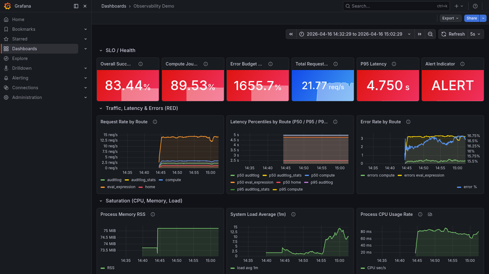

# Observability Demo

A full-stack observability reference implementation built on the Grafana LGTM stack (Loki, Grafana, Tempo, Mimir). A Python Flask application emits traces, metrics, and logs via OpenTelemetry. A dedicated canary container continuously exercises every endpoint at a calibrated rate. Everything runs locally with a single command.

---

## Table of Contents

- [Architecture](#architecture)
- [Data Flow](#data-flow)
- [Services](#services)
- [Endpoints](#endpoints)
- [Quick Start — Existing Machine](#quick-start--existing-machine)
- [Setup — Brand New Ubuntu Machine](#setup--brand-new-ubuntu-machine)
- [Running Tests](#running-tests)
- [Scripts Reference](#scripts-reference)
- [Project Structure](#project-structure)
- [Canary Workload](#canary-workload)
- [Expression Evaluator](#expression-evaluator)

---

## Architecture

```
┌─────────────────────────────────────────────────────────────────────────┐
│                        observability-network (Docker bridge)            │
│                                                                         │
│  ┌──────────────┐   HTTP/gRPC    ┌─────────────────────────────────┐   │
│  │    canary    │ ─────────────► │       observability-demo         │   │
│  │  (Python)    │                │         (Flask app)              │   │
│  │  24 TPS      │                │  GET /                           │   │
│  │  20 targets  │                │  GET /compute/<n>                │   │
│  └──────────────┘                │  GET|POST /auditlog              │   │
│                                  │  GET /auditlog/stats             │   │
│                                  │  GET|POST /eval                  │   │
│                                  └──────────┬──────────────────────┘   │
│                                             │ OTLP gRPC (4317)         │
│                                             ▼                           │
│                                  ┌──────────────────┐                  │
│                                  │  otel-collector  │                  │
│                                  │  (OTel Contrib)  │                  │
│                                  └──┬───────┬───────┘                  │
│                    traces ──────────┘       │ metrics    logs           │
│                       ▼                     ▼              ▼            │
│              ┌────────────────┐  ┌────────────────┐  ┌──────────┐     │
│              │     tempo      │  │     mimir      │  │   loki   │     │
│              │  (tracing)     │  │  (metrics)     │  │  (logs)  │     │
│              └───────┬────────┘  └───────┬────────┘  └────┬─────┘     │
│                      │ Kafka ingest       │ remote write   │           │
│              ┌───────▼────────┐  ┌───────▼────────┐       │           │
│              │   redpanda     │  │   prometheus   │       │           │
│              │  (Kafka broker)│  │  (scrape+fwd)  │       │           │
│              └────────────────┘  └───────┬────────┘       │           │
│                                          │ pg metrics      │           │
│                                  ┌───────▼────────┐        │           │
│                                  │postgres-export │        │           │
│                                  └───────┬────────┘        │           │
│                                          │                  │           │
│                                  ┌───────▼────────┐        │           │
│                                  │   postgres     │        │           │
│                                  │  (audit_logs)  │        │           │
│                                  └────────────────┘        │           │
│                                                             │           │
│  ┌──────────────────────────────────────────────────────────▼────────┐ │
│  │                          grafana                                   │ │
│  │   datasources: Tempo · Mimir · Loki    dashboard: auto-provisioned │ │
│  └────────────────────────────────────────────────────────────────────┘ │
└─────────────────────────────────────────────────────────────────────────┘
```

---

## Data Flow

### Telemetry pipeline

```
Flask app
    │
    ├─ Traces ──► OTel Collector ──► Tempo ──────────────────► Grafana
    │                                    └─► Redpanda (Kafka)
    │
    ├─ Metrics ─► OTel Collector ──► Mimir ◄── Prometheus ◄── postgres-exporter ◄── Postgres
    │                                               └──────────────────────────────► Grafana
    │
    └─ Logs ───► OTel Collector ──► Loki ───────────────────► Grafana
```

### Request flow — /eval endpoint

```
Client
  │  GET /eval?expr=((3+4)*6^2/5)+1-7
  ▼
Flask /eval route
  │
  ├─ tokenise()        "((3+4)*6^2/5)+1-7"
  │    └─► [LEFT_PAREN, LEFT_PAREN, 3, +, 4, RIGHT_PAREN, *, 6, ^, 2, /, 5, ...]
  │
  ├─ to_rpn()          Shunting-Yard algorithm
  │    └─► [3, 4, +, 6, 2, ^, *, 5, /, 1, +, 7, -]
  │
  ├─ evaluate_rpn()    operand stack
  │    └─► 44.4
  │
  └─► {"expression": "((3+4)*6^2/5)+1-7", "result": 44.4}
```

### Canary flow

```
canary container
  │
  ├─ wait_for_app()    polls http://observability-demo:5000/ until 200
  │
  └─ loop (24 TPS, paced inter-arrival = 1/24 ≈ 42 ms)
       │
       ├─ fire request ──► observability-demo
       ├─ measure response_time
       ├─ emit OTel metrics (client="canary") ──► otel-collector ──► mimir
       └─ sleep max(0, 0.042 - response_time)
```

### Audit log write flow

```
POST /auditlog
  │
  ├─ collect system snapshot
  │    process RSS, CPU seconds, system load avg
  │    cgroup memory current/limit/%, CPU ns
  │
  ├─ with_db() ──► INSERT INTO audit_logs ──► Postgres
  │    └─ conn.close() guaranteed in finally block
  │
  └─► {"status": "ok", "audit_id": <id>, ...}
```

---

## Grafana Dashboard

The pre-provisioned dashboard is available at **http://localhost:3000** immediately after `./launch.sh` completes. No login required (anonymous admin).



The dashboard is organised into collapsible rows:

| Row | What it shows |
|---|---|
| SLO / Health | Overall success rate, compute journey success rate, error budget burn, total RPS, P95 latency, alert indicator |
| Traffic, Latency & Errors (RED) | Request rate by route, latency percentiles (p50/p95/p99), error rate + error % |
| Saturation | Process RSS memory, system load average (1m), process CPU rate |
| Container Resources | Memory used vs limit, memory %, CPU cores |
| Synthetic Workload | Canary request rate by path, canary P95 latency by path |
| PostgreSQL | Active connections, cache hit rate, commit vs rollback rate, rows fetched/inserted/updated |
| Logs (Loki) | Live application log stream, errors-only filtered view |

---

## Services

| Container | Image | Port | Role |
|---|---|---|---|
| `observability-demo` | local build | 5000 | Flask app — compute, audit log, expression eval |
| `canary` | local build | — | Synthetic canary, 24 TPS, all endpoints |
| `otel-collector` | otel-contrib | 4317 (gRPC), 4318 (HTTP) | Receives OTLP, routes to backends |
| `tempo` | grafana/tempo | 3200 | Distributed tracing backend |
| `redpanda` | redpandadata/redpanda | 9092 | Kafka broker for Tempo ingest |
| `mimir` | grafana/mimir | 9009 | Long-term metrics storage |
| `loki` | grafana/loki | 3100 | Log aggregation |
| `grafana` | grafana/grafana | 3000 | Dashboards — Tempo + Mimir + Loki |
| `prometheus` | prom/prometheus | 9090 | Scrapes postgres-exporter, remote-writes to Mimir |
| `postgres-exporter` | wrouesnel/postgres_exporter | 9187 (internal) | Exports pg_* metrics |
| `postgres` | postgres:16 | 5432 | Audit log persistence |

---

## Endpoints

| Method | Path | Description |
|---|---|---|
| `GET` | `/` | Home page with compute links |
| `GET` | `/compute/<n>` | Compute Fibonacci(n). 10% random 500 error rate by design |
| `GET\|POST` | `/auditlog` | Write system snapshot to Postgres, return audit record |
| `GET` | `/auditlog/stats` | Response time percentiles (p50/p90/p95/p99) + histogram |
| `GET\|POST` | `/eval?expr=<expression>` | Evaluate a mathematical expression (PEMDAS, no eval()) |

### /eval examples

```bash
# Simple arithmetic
curl "http://localhost:5000/eval?expr=3+4"
# {"expression":"3+4","result":7.0}

# Nested PEMDAS
curl "http://localhost:5000/eval?expr=((3%2B4)*6%5E2%2F5)%2B1-7"
# {"expression":"((3+4)*6^2/5)+1-7","result":44.4}

# POST with JSON
curl -X POST http://localhost:5000/eval \
  -H 'Content-Type: application/json' \
  -d '{"expr": "(2+3)^2"}'
# {"expression":"(2+3)^2","result":25.0}

# Error handling
curl "http://localhost:5000/eval?expr=5/0"
# {"error":"Division by zero"}  HTTP 400
```

---

## Quick Start — Existing Machine

Requires: Docker 20+, Docker Compose v2+, `curl`, `git`.

```bash
git clone https://github.com/sethusrinivasan/observability-demo.git
cd observability-demo
./launch.sh
```

`launch.sh` handles everything: teardown of any previous stack, fresh build, startup, and readiness polling. When it completes:

| Service | URL |
|---|---|
| App | http://localhost:5000 |
| Grafana | http://localhost:3000 |
| Prometheus | http://localhost:9090 |
| Tempo | http://localhost:3200 |
| Loki | http://localhost:3100 |
| Mimir | http://localhost:9009 |

---

## Setup — Brand New Ubuntu Machine

Tested on Ubuntu 22.04 LTS, 24.04 LTS, and 25.10. Requires a user with `sudo` access.

### 1. System update

```bash
sudo apt-get update && sudo apt-get upgrade -y
```

### 2. Install prerequisites

```bash
sudo apt-get install -y \
    ca-certificates \
    curl \
    gnupg \
    git \
    python3 \
    python3-venv \
    python3-pip
```

### 3. Install Docker Engine

```bash
# Add Docker's official GPG key
sudo install -m 0755 -d /etc/apt/keyrings
curl -fsSL https://download.docker.com/linux/ubuntu/gpg \
    | sudo gpg --dearmor -o /etc/apt/keyrings/docker.gpg
sudo chmod a+r /etc/apt/keyrings/docker.gpg

# Add the Docker repository
echo \
  "deb [arch=$(dpkg --print-architecture) signed-by=/etc/apt/keyrings/docker.gpg] \
  https://download.docker.com/linux/ubuntu \
  $(. /etc/os-release && echo "$VERSION_CODENAME") stable" \
  | sudo tee /etc/apt/sources.list.d/docker.list > /dev/null

# Install Docker Engine + Compose plugin
sudo apt-get update
sudo apt-get install -y docker-ce docker-ce-cli containerd.io \
    docker-buildx-plugin docker-compose-plugin
```

### 4. Add your user to the docker group

```bash
sudo usermod -aG docker $USER
newgrp docker          # apply without logging out
```

Verify:
```bash
docker run --rm hello-world
docker compose version
```

### 5. Configure passwordless sudo (recommended for launch.sh)

`launch.sh` uses `sudo` to kill root-owned containers and restore iptables rules after Docker daemon restarts. To avoid password prompts:

```bash
echo "$USER ALL=(ALL) NOPASSWD:ALL" | sudo tee /etc/sudoers.d/$USER-nopasswd
sudo chmod 440 /etc/sudoers.d/$USER-nopasswd
```

### 6. Clone and launch

```bash
git clone https://github.com/sethusrinivasan/observability-demo.git
cd observability-demo
chmod +x launch.sh start.sh test.sh build.sh redeploy.sh
./launch.sh
```

Expected output:
```
=== Clearing any existing containers ===
=== Tearing down compose stack ===
  (volumes wiped)
=== Building and launching stack ===
  [builds observability-demo and canary images]
=== Waiting for services ===
  ✓ Tempo
  ✓ Loki
  ✓ Mimir
  ✓ Prometheus
  ✓ App
  Waiting for Grafana ✓
  ✓ Canary
=== Stack status ===
  [table of all 11 containers]
```

> **Note on Grafana startup time:** On a fresh volume Grafana runs database migrations which takes 30–60 seconds. `launch.sh` polls until it's ready.

### 7. Set up Python virtual environment (for running tests locally)

```bash
python3 -m venv .venv
source .venv/bin/activate
pip install -r requirements.txt
pip install setuptools   # required on Python 3.13+
```

### 8. Run tests

```bash
# Unit + integration tests (no stack required for unit tests)
.venv/bin/python -m pytest tests/ -v

# Smoke test against the running stack
./test.sh
```

### Minimum hardware requirements

| Resource | Minimum | Recommended |
|---|---|---|
| CPU | 2 cores | 4 cores |
| RAM | 4 GB | 8 GB |
| Disk | 5 GB free | 10 GB free |

> Redpanda alone uses ~1 GB RAM. The full stack at idle uses ~2.5 GB.

---

## Running Tests

```bash
# All tests (unit + evaluator + infrastructure smoke tests)
.venv/bin/python -m pytest tests/ -v

# Unit tests only (no stack needed)
.venv/bin/python -m pytest tests/test_app.py tests/test_evaluator.py -v

# Infrastructure tests (requires running stack)
.venv/bin/python -m pytest tests/test_infrastructure.py -v

# Shell smoke test against live stack
./test.sh
```

Test breakdown:

| File | Tests | Requires stack |
|---|---|---|
| `tests/test_app.py` | 48 | Postgres only |
| `tests/test_evaluator.py` | 69 | No |
| `tests/test_infrastructure.py` | 41 | Yes (all services) |

---

## Scripts Reference

| Script | Purpose |
|---|---|
| `./launch.sh` | Full teardown + fresh deploy. Use on first run or after config changes. Accepts `--keep-data` to preserve volumes |
| `./launch.sh --keep-data` | Redeploy without wiping Postgres/Grafana/Mimir data |
| `./start.sh` | Start stack without teardown (faster, keeps existing containers) |
| `./test.sh` | Smoke test all endpoints against the running stack |
| `./redeploy.sh` | Rebuild and replace only `observability-demo` and `canary` containers |
| `./build.sh` | Build the app Docker image only |

---

## Project Structure

```
observability-demo/
├── app.py                          # Flask application
├── evaluator.py                    # Shunting-Yard expression evaluator
├── Dockerfile                      # App container image
├── requirements.txt                # Python dependencies
├── docker-compose.yaml             # Full stack definition (11 services)
│
├── canary/
│   ├── canary.py                   # Standalone synthetic canary
│   ├── Dockerfile                  # Canary container image
│   └── requirements.txt            # Minimal deps (requests + OTel only)
│
├── config/
│   ├── otel-collector.yaml         # OTLP receiver → Tempo/Mimir/Loki routing
│   ├── tempo.yaml                  # Trace storage + Kafka ingest
│   ├── loki.yaml                   # Log storage (filesystem, schema v13)
│   ├── mimir.yaml                  # Metrics storage (filesystem)
│   ├── prometheus.yaml             # Scrape postgres-exporter, remote-write to Mimir
│   ├── grafana-datasources.yaml    # Auto-provision Tempo, Mimir, Loki datasources
│   ├── grafana-dashboard-provider.yaml
│   └── dashboards/
│       └── observability-demo-metrics.json   # Pre-built Grafana dashboard
│
├── tests/
│   ├── conftest.py                 # Python 3.13 compat shims, host/Docker DB resolution
│   ├── test_app.py                 # Flask route + DB unit tests (48 tests)
│   ├── test_evaluator.py           # Evaluator pipeline unit tests (69 tests)
│   └── test_infrastructure.py     # End-to-end container smoke tests (41 tests)
│
├── pytest.ini                      # Test config (no cache, suppress OTel warnings)
├── launch.sh                       # Full teardown + deploy script
├── start.sh                        # Quick start script
├── redeploy.sh                     # Rebuild app + canary only
├── build.sh                        # Build app image only
└── test.sh                         # Shell smoke test
```

---

## Canary Workload

The canary runs in its own container (`canary/`) completely isolated from the app. It exercises all 20 endpoint targets at a uniform rate.

**Rate calibration:**
- Target: 24 TPS → ~50% saturation of one CPU core on a 4-core host
- Pacing: `sleep = max(0, 1/TPS - response_time)` — uniform inter-arrival regardless of endpoint latency
- Tune via env var: `CANARY_TPS=10 docker compose up`

**Coverage:**

| Endpoint | Cases |
|---|---|
| `GET /` | 1 |
| `GET /compute/<n>` | 3 (n=5, 10, 20) |
| `GET /auditlog` | 1 |
| `POST /auditlog` | 1 |
| `GET /auditlog/stats` | 1 |
| `GET /eval` | 9 (one per operator/feature) |
| `POST /eval` (JSON) | 1 |
| `GET /eval` error paths | 3 (÷0, invalid char, missing param) |

Error-path canaries (expected 4xx) are counted as `success` in metrics so they don't inflate the error rate.

View canary logs:
```bash
docker logs -f canary
```

---

## Expression Evaluator

`/eval` implements a mathematical expression parser from scratch using the **Shunting-Yard algorithm** (Dijkstra, 1961). No `eval()`, no third-party parsing libraries.

**Pipeline:**
```
expression string
    │
    ▼ tokenise()
[NUMBER, OPERATOR, LEFT_PAREN, ...]
    │
    ▼ to_rpn()   ← Shunting-Yard
[RPN token list]
    │
    ▼ evaluate_rpn()   ← operand stack
float result
```

**PEMDAS operator table:**

| Operator | Precedence | Associativity | Example |
|---|---|---|---|
| `^` | 4 (highest) | Right | `2^3^2` = `2^(3^2)` = 512 |
| `*` `/` | 3 | Left | `12/4*3` = `(12/4)*3` = 9 |
| `+` `-` | 2 (lowest) | Left | `10-3+2` = `(10-3)+2` = 9 |

**Supported:**
- Integers and decimals: `3`, `3.14`
- All five operators: `+` `-` `*` `/` `^`
- Nested parentheses: `((3+4)*6^2/5)+1-7` → `44.4`
- Unary minus: `-5+8` → `3.0`
- Error handling: division by zero, mismatched parentheses, invalid characters
