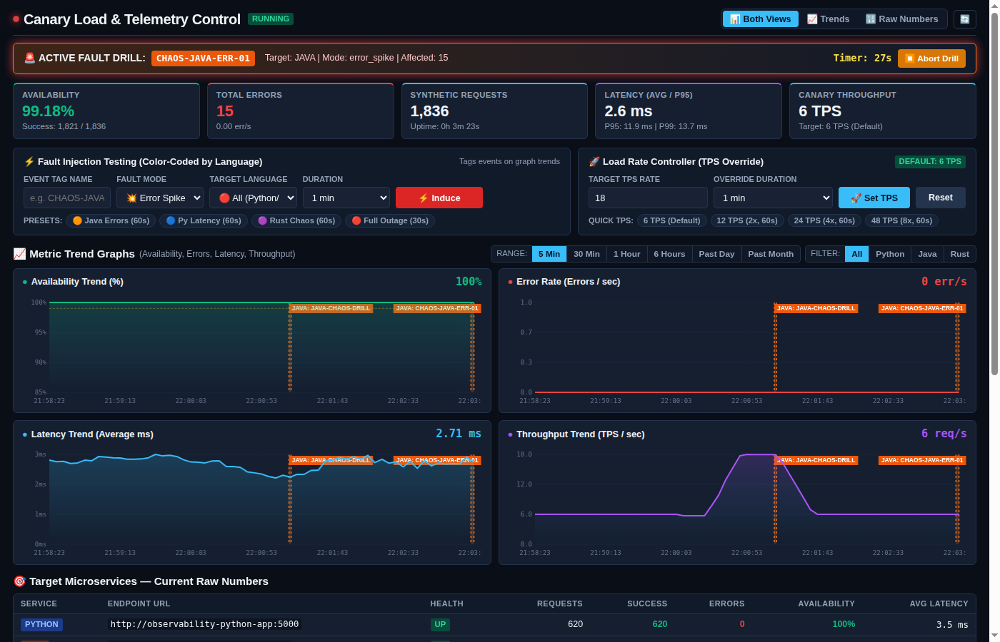
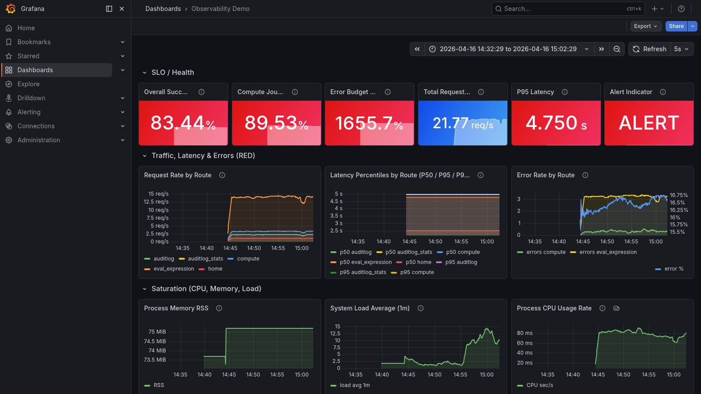

# Observability Demo

<div align="center">

[](https://deepmind.google/technologies/)
[](https://deepmind.google/technologies/gemini/)
[](https://www.python.org/)
[](https://spring.io/projects/spring-boot)
[](https://github.com/tokio-rs/axum)
[](https://nodejs.org/)
[](https://go.dev/)
[](https://dotnet.microsoft.com/)
[](https://en.wikipedia.org/wiki/C_(programming_language))
[](https://opentelemetry.io/)
[](https://grafana.com/)
[](https://www.docker.com/)

</div>

---

An end-to-end polyglot observability playground demonstrating production-grade telemetry across **Python (Flask)**, **Java (Spring Boot)**, **Rust (Axum)**, **Node.js (Express)**, **Go (net/http)**, **C# .NET (ASP.NET Core)**, and **C (POSIX C99)** microservices. Telemetry (traces, metrics, logs) is collected via OpenTelemetry Collector and exported to the **Grafana LGTM stack** (Loki, Grafana, Tempo, Mimir), alongside a PostgreSQL audit layer and an interactive synthetic **Canary Traffic & Fault Injection Dashboard**.

Deployable locally via **Docker Compose** or **Kubernetes (Kind)**.

---

## Architecture & Dashboards

### Canary Load & Telemetry Dashboard (`http://<HOST_IP>:8085`)
Interactive control center featuring real-time & historical trend graphs across 6 time ranges, language-color-coded fault injection testing, and dynamic load pacing.



### Grafana LGTM Observability Dashboard (`http://<HOST_IP>:3000`)
Consolidated distributed tracing (Tempo), metrics (Mimir/Prometheus), logs (Loki), and infrastructure health.



---

## Features

* **Multi-Language Telemetry Parity**: Identical endpoint semantics, custom OTel histograms/counters, and tracing context across Python, Java, Rust, Node.js, Go, C# .NET, and C (POSIX).
* **Canary Load & Operations Station**:
  * **Collapsible Controls Drawer**: Chaos fault injection, target crashes, TPS overrides, and container power controls are enclosed in an expandable drawer that is **collapsed by default** to preserve screen real estate for clean monitoring.
  * **Container Power & Resource Management**: Shut down and restart individual containers hosting specific languages directly from the dashboard or mobile app to conserve system resources. Canary synthetic workload automatically detects container states and suspends requests to stopped containers, preventing artificial failure spikes.
  * **PostgreSQL SQL Query Editor & Data Grid**: First-principles interactive query runner inspired by SSMS, pgAdmin, and DataGrip. Features curated saved queries, query execution timing, and a responsive tabular data grid with `#` row numbering, sortable headers, and CSV/JSON export.
  * **Dependencies Health Telemetry**: Dedicated view rolling up availability %, roundtrip latency (ms), error rates, and resource capacity across all 9 stack dependencies (PostgreSQL, Valkey, OTel Collector, Tempo, Loki, Mimir, Prometheus, Grafana, Redpanda).
  * **Historical Trend Graphs**: Availability (%), Error Rate (err/s), Response Latency (ms), and Throughput (TPS) queried directly from Mimir across 6 horizons (`5m`, `30m`, `1h`, `6h`, `1d`, `30d`).
  * **Fault Injection Testing (Chaos Drills)**: Induce `Error Spikes`, `High Latency (+1000ms)`, `Service Outage (Drops)`, or `Intermittent Errors` with custom event tagging.
  * **Chaos Crash Triggering (Thread / Process Crash)**: Directly issue requests from the dashboard to target test environments to trigger process crashes or worker thread crashes with tagged events.
  * **Language-Specific Event Color Coding**: Fault events are visually tagged and overlaid on trend charts using distinct language color palettes (🟠 Java, 🔵 Python, 🟣 Rust, 🟢 Node, 🩵 Go, 💜 .NET, ⚙️ C, 🔴 All).
  * **Dynamic Load Controller**: Bump up Canary TPS from baseline (6 TPS) to higher rates (e.g., 12, 24, 48 TPS) with automatic expiration and reset controls.
* **Cloudflare Tunnel Live Showcase Bridge (`scripts/showcase_tunnel.sh`)**: Zero-port-forwarding public HTTPS access engineered for hosting 24/7 live showcases on residential broadband connections from your internet service provider. Supports instant TryCloudflare quick tunnels (zero accounts or domains required) or permanent Cloudflare Zero Trust custom domains with automated TLS and DDoS protection. See [`docs/cloudflare-tunnel-showcase.md`](./docs/cloudflare-tunnel-showcase.md).
* **Cross-Platform React Native Mobile App (`mobile/`)**: Native companion client for Android, iOS, Windows, and Web. Includes an interactive SVG QR code in the Canary dashboard for instant mobile scanning and connection pairing.
* **Software Bill of Materials (SBOM)**: Comprehensive machine-readable CycloneDX 1.5 JSON artifact ([`sbom/sbom-cyclonedx.json`](./sbom/sbom-cyclonedx.json)) and detailed Markdown documentation ([`docs/sbom.md`](./docs/sbom.md)) acknowledging the implementation details and architectural inspirations for all polyglot microservices and stack components.
* **Distributed Tracing**: OTLP traces streamed from microservices through OpenTelemetry Collector into Grafana Tempo.
* **Metrics & Aggregations**: Standardized RED metrics (Rate, Errors, Duration) stored in Grafana Mimir.
* **Structured Logging**: Unified OTLP log pipeline shipping structured JSON logs to Grafana Loki.
* **PostgreSQL Audit Log**: Thread-safe connection pooling and automatic schema initialization recording audit events.
* **Mathematical Expression Evaluator**: Clean zero-dependency AST parser implementing the Shunting-Yard / recursive-descent algorithm across all seven languages.

---

## Quick Start

### Docker Compose

```bash
./launch_docker.sh --run               # Full teardown, build & deploy
./launch_docker.sh --run --keep-data   # Deploy while preserving database volumes
./launch_docker.sh --run --tunnel      # Deploy with live Cloudflare showcase tunnel
./scripts/showcase_tunnel.sh --quick   # Instant public HTTPS showcase link (zero config)
./launch_docker.sh --teardown-only     # Stop and clean up containers
```

Once deployment completes, access the services:

> [!TIP]
> **Network Addressing**: Replace `<HOST_IP>` with your host machine's LAN IP address (e.g. `192.168.1.50`, or auto-discovered in the Canary QR code modal) for access across your local network and mobile devices. Use `localhost` if connecting locally on the same host.

| Component | URL | Credentials / Notes |
|-----------|-----|---------------------|
| **Canary Dashboard** | `http://<HOST_IP>:8085` | Trend graphs, fault injection & TPS controls |
| **Grafana** | `http://<HOST_IP>:3000` | `admin` / `admin` (Anonymous login disabled) |
| **Python App** | `http://<HOST_IP>:5000` | Flask + Gunicorn WSGI |
| **Java App** | `http://<HOST_IP>:8080` | Spring Boot 3 + Spring MVC |
| **Rust App** | `http://<HOST_IP>:8083` | Tokio + Axum async runtime (8081 on Kind) |
| **Node.js App** | `http://<HOST_IP>:8084` | Node.js 20 + Express (30007 on Kind) |
| **Go App** | `http://<HOST_IP>:8086` | Go 1.23 + net/http (30008 on Kind) |
| **.NET App** | `http://<HOST_IP>:8087` | C# .NET 8 + ASP.NET Core (30009 on Kind) |
| **C App** | `http://<HOST_IP>:8088` | POSIX C99 Sockets + libpq (30010 on Kind) |
| **Prometheus** | `http://<HOST_IP>:9090` | Target scrapers & metrics |
| **Grafana Mimir** | `http://<HOST_IP>:9009` | Long-term PromQL metrics engine |
| **Grafana Tempo** | `http://<HOST_IP>:3200` | Distributed trace backend |
| **Grafana Loki** | `http://<HOST_IP>:3100` | Log aggregation engine |

### Live Showcase & Remote Access (Cloudflare Tunnel)

To access your stack remotely or share a live demo with anyone in the world without opening ports on your router or exposing your home network, the platform includes integrated **Cloudflare Tunnel (`cloudflared`)** support. This completely bypasses any inbound port restrictions or dynamic IP changes from your internet service provider through an encrypted outbound tunnel with automated TLS/HTTPS.

#### How to Use It Right Now

##### 1. Instant Public Showcase (Zero Configuration — No Account Required)
To spin up a live public HTTPS link in ~3 seconds with zero accounts and zero configuration:

```bash
./scripts/showcase_tunnel.sh --quick
```

This provisions an instant TryCloudflare HTTPS URL:
```text
=================================================================
 🎉 LIVE PUBLIC SHOWCASE URL READY!
=================================================================
  Public HTTPS URL:  https://your-random-subdomain.trycloudflare.com
  Target Service:    Canary Telemetry & Load Dashboard (port 8085)
```
* **World-Wide Access**: Share this URL with anyone on mobile, tablet, or desktop.
* **Auto-Discovery**: The Canary dashboard's QR code modal automatically detects this tunnel URL so mobile scans connect seamlessly over public HTTPS.
* **Check Status**: `./scripts/showcase_tunnel.sh --status`
* **Stop Tunnel**: `./scripts/showcase_tunnel.sh --stop`

##### 2. Permanent 24/7 Custom Domain Showcase (Cloudflare Zero Trust Free Tier)
For a permanent, branded showcase (e.g. `showcase.yourdomain.com` for Canary and `grafana.yourdomain.com` for Grafana):

1. **Obtain Free Tunnel Token**:
   * Navigate to the [Cloudflare Dashboard](https://dash.cloudflare.com/) -> **Zero Trust** -> **Networks** -> **Tunnels**.
   * Click **Create Tunnel** -> Choose **Cloudflared** -> Name your tunnel.
   * Under **Install and run a connector**, select **Docker** and copy the tunnel token.
2. **Configure Public Hostnames in Cloudflare**:
   * `showcase.yourdomain.com` -> Service: `HTTP`, URL: `canary:8085`
   * `grafana.yourdomain.com` -> Service: `HTTP`, URL: `grafana:3000`
3. **Launch the Tunnel**:
   ```bash
   # Option A: Direct launch with token
   ./scripts/showcase_tunnel.sh --token <YOUR_CLOUDFLARE_TUNNEL_TOKEN>

   # Option B: Persistent deployment via .env
   echo "CLOUDFLARE_TUNNEL_TOKEN=<YOUR_CLOUDFLARE_TUNNEL_TOKEN>" >> .env
   ./launch_docker.sh --run --keep-data --tunnel
   ```

For detailed architecture diagrams, 24/7 power outage recovery, and systemd autostart service templates, see [`docs/cloudflare-tunnel-showcase.md`](./docs/cloudflare-tunnel-showcase.md).

### Kubernetes (Kind)

```bash
./launch_k8s.sh --run              # Spin up Kind cluster, build images, and apply manifests
./launch_k8s.sh --teardown-only    # Delete Kind cluster
```

*Port-forwarding is established automatically by the launch script.*

---

## Stack Components

| Component | Port | Purpose | Version |
|---|---|---|---|
| [Python Service](./app.py) | `5000` | Flask WSGI service, DB connection pool, Shunting-Yard evaluator | `1.0.1` |
| [Java Service](./java-app) | `8080` | Spring Boot service, Spring Data JDBC, Actuator health probes | `1.0.1` |
| [Rust Service](./rust-app) | `8083` (Docker) / `8081` (Kind) | Axum asynchronous service, SQLx Postgres pool, tokenizer evaluator | `1.0.1` |
| [Node.js Service](./node-app) | `8084` (Docker) / `30007` (Kind) | Express asynchronous service, pg connection pool, recursive-descent evaluator | `1.0.1` |
| [Go Service](./go-app) | `8086` (Docker) / `30008` (Kind) | Go net/http service, lib/pq connection pool, recursive-descent evaluator | `1.0.1` |
| [.NET Service](./dotnet-app) | `8087` (Docker) / `30009` (Kind) | C# .NET 8 ASP.NET Core service, Npgsql connection pool, recursive-descent evaluator | `1.0.1` |
| [C Service](./c-app) | `8088` (Docker) / `30010` (Kind) | POSIX C99 multi-threaded socket service, libpq, zero-dependency evaluator | `1.0.1` |
| [Canary Dashboard](./canary) | `8085` | Synthetic traffic generator, historical trend graphs, chaos fault injection | `1.0.1` |
| [Canary Mobile App](./mobile) | — | Cross-platform React Native client for Android, iOS, Windows, Web | `1.0.0` |
| [CycloneDX SBOM](./sbom/sbom-cyclonedx.json) | — | Software Bill of Materials & architectural acknowledgments | `1.5` |
| Grafana | `3000` | Provisioned dashboards and data source integration (`admin`/`admin`) | `latest` |
| Grafana Image Renderer | `8081` | Headless Chromium sidecar for automated PNG panel rendering | `latest` |
| Prometheus | `9090` | Exporter scraper and metrics buffer | `latest` |
| Grafana Mimir | `9009` | Distributed long-term metrics storage | `latest` |
| Grafana Tempo | `3200` | Distributed tracing backend (backed by Redpanda) | `latest` |
| Grafana Loki | `3100` | Log aggregation backend | `latest` |
| OTel Collector | `4317` (gRPC) / `4318` (HTTP) | Telemetry ingestion and routing pipeline | `latest` |
| PostgreSQL | `5432` | Audit log database with persistence | `16.1` |
| Postgres Exporter | `9187` | Database runtime metrics (connections, locks, buffers) | `latest` |
| Valkey | `6379` | High-performance Redis fork for canary counters and event logs | `latest` |
| Redis Exporter | `9121` | Prometheus scraper for Valkey cache telemetry | `latest` |
| Redpanda | `9092` | Kafka-compatible distributed event log for Tempo traces | `latest` |

---

## API Endpoints Matrix

Every microservice implements identical API contracts:

| Route | Method | Description | Sample Query |
|---|---|---|---|
| `/` | `GET` | Service index & environment info | `curl http://<HOST_IP>:5000/` |
| `/version` | `GET` | Service metadata, language, and version | `curl http://<HOST_IP>:8080/version` |
| `/selftest` | `GET` | In-process internal unit verification | `curl http://<HOST_IP>:8083/selftest` |
| `/compute/<n>` | `GET` | Fibonacci calculation (rejects `n > 25`) | `curl http://<HOST_IP>:5000/compute/10` |
| `/auditlog` | `GET`, `POST` | Insert/query persistent audit log record | `curl -X POST http://<HOST_IP>:8080/auditlog -d "source=cli"` |
| `/auditlog/stats` | `GET` | Aggregated audit log row statistics | `curl http://<HOST_IP>:8083/auditlog/stats` |
| `/eval?expr=...` | `GET`, `POST` | Custom zero-eval arithmetic expression parser | `curl "http://<HOST_IP>:5000/eval?expr=2%2B3*4"` |
| `/crash` | `GET`, `POST` | Chaos testing: triggers process or thread crash (`?type=process` or `?type=thread`) | `curl -X POST "http://<HOST_IP>:8080/crash?type=thread"` |

*Note: For the `/eval` endpoint, operators like `+` must be URL-encoded (`%2B`).*

---

## Testing & Verification

Comprehensive multi-layer test suite covering unit tests, evaluator logic, infrastructure health, and end-to-end integration:

```bash
# Multi-language integration smoke tests
python3 tests/smoke_test.py --docker

# Run unit and infrastructure test suite
pytest tests/ -v
```

---

## AI Tooling & Attribution

This project was developed, debugged, and enhanced with the assistance of modern agentic AI systems:

* **[Google Antigravity](https://deepmind.google/technologies/)**: Autonomous engineering pair programmer used for end-to-end telemetry architecture, root-cause diagnosis of microservice anomalies, chaos engineering design, and full-stack dashboard implementation.
* **[Gemini CLI](https://deepmind.google/technologies/gemini/)**: Advanced agentic coding workflows for polyglot code synchronization across Python, Java, Rust, Node.js, Go, C# .NET, and C, PromQL query optimization, and test automation.

---

## License

This project is licensed under the Apache License 2.0.
